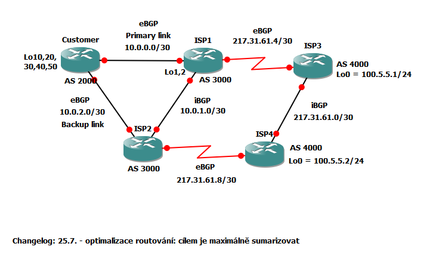

# BGP lab
**Cisco GNS3 BGP lab**

## Topologie

## Aktivní prvky
### Customer (AS 2000)
Konfigurace: [Customer.cfg](/configs/Customer.cfg)
 - Koncový prvek zákazníka (CPE).
 - Vlastní BGP AS 2000.
 - 2x BGP peer s AS 3000.
 - Hlavní a záložní linka pomocí `local-preference ` a `route-map`.
 - Zákazník má 5x /C IPv4 které jsou v BGP sumarizovány: `aggregate-address 192.168.0.0 255.255.192.0`
 - ISP AS 3000 posílá zákazníkovy výchozí bránu ze směrovačů ISP1 a ISP2 (hlavní a záložní linka)
 
 ### ISP1 a ISP2 (AS 3000)
 Konfigurace: [ISP1.cfg](/configs/ISP1.cfg) a [ISP2.cfg](/configs/ISP2.cfg) 
  - Síť poskytovatele s redundantními směrovači (stejná konfigurace).
  - Poskytuje konektivitu zákazníka a peeruje s AS 4000 přes dvě linky.
  - Mezi ISP1 a ISP2 je promozováno iBGP.
  - Od zázazníka přímá jen sumarizovanou cestu (`prefix-list Summary in`).
  - Zákazník dostává jen prefixy, které patří AS 3000 (`filter-list 1 out`).
  - Poskytovatel AS 3000 posílá směrem ven k AS 4000 jen své prefixy (`distribute-list YesRoute out`).
 
 ### ISP3 a ISP3 (AS 4000)
 Konfigurace: [ISP3.cfg](/configs/ISP3.cfg) a [ISP4.cfg](/configs/ISP4.cfg) 
  - TO DO.
