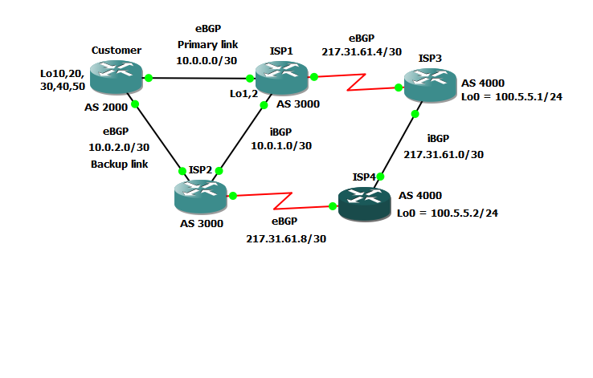

# BGP lab
**Cisco GNS3 BGP lab**

## Topologie


## Aktivní prvky
### Customer (AS 2000)
Konfigurace: [Customer.cfg](/configs/Customer.cfg)
 - Koncový prvek zákazníka (CPE).
 - Vlastní BGP AS 2000.
 - 2x BGP peer s AS 3000.
 - Hlavní a záložní linka pomocí `local-preference ` a `route-map`.
 - Zákazník má 5x /C IPv4 které jsou v BGP sumarizovány: `aggregate-address 192.168.0.0 255.255.192.0`.
 - ISP AS 3000 posílá zákazníkovy výchozí bránu ze směrovačů ISP1 a ISP2 (hlavní a záložní linka).
 
**BGP běžící na Customer směrovači:**
```
Customer#show bgp
BGP table version is 11, local router ID is 192.168.50.1
Status codes: s suppressed, d damped, h history, * valid, > best, i - internal,
              r RIB-failure, S Stale
Origin codes: i - IGP, e - EGP, ? - incomplete

   Network          Next Hop            Metric LocPrf Weight Path
*  0.0.0.0          10.0.2.2                 0    125      0 3000 i
*>                  10.0.0.2                 0    150      0 3000 i
*> 192.168.0.0/18   0.0.0.0                            32768 i
s> 192.168.20.0     0.0.0.0                  0         32768 i
s> 192.168.30.0     0.0.0.0                  0         32768 i
s> 192.168.40.0     0.0.0.0                  0         32768 i
s> 192.168.50.0     0.0.0.0                  0         32768 i
```
```
Customer#show ip bgp summary
BGP router identifier 192.168.50.1, local AS number 2000
BGP table version is 11, main routing table version 11
6 network entries using 702 bytes of memory
7 path entries using 364 bytes of memory
6/3 BGP path/bestpath attribute entries using 744 bytes of memory
1 BGP AS-PATH entries using 24 bytes of memory
0 BGP route-map cache entries using 0 bytes of memory
0 BGP filter-list cache entries using 0 bytes of memory
BGP using 1834 total bytes of memory
BGP activity 6/0 prefixes, 7/0 paths, scan interval 60 secs

Neighbor        V    AS MsgRcvd MsgSent   TblVer  InQ OutQ Up/Down  State/PfxRcd
10.0.0.2        4  3000     276     277       11    0    0 04:32:11        1
10.0.2.2        4  3000     276     277       11    0    0 04:32:13        1
```

**Směrovací tabulka na Customer směrovači:**
```
Customer#show ip route
Codes: C - connected, S - static, R - RIP, M - mobile, B - BGP
       D - EIGRP, EX - EIGRP external, O - OSPF, IA - OSPF inter area
       N1 - OSPF NSSA external type 1, N2 - OSPF NSSA external type 2
       E1 - OSPF external type 1, E2 - OSPF external type 2
       i - IS-IS, su - IS-IS summary, L1 - IS-IS level-1, L2 - IS-IS level-2
       ia - IS-IS inter area, * - candidate default, U - per-user static route
       o - ODR, P - periodic downloaded static route

Gateway of last resort is 10.0.0.2 to network 0.0.0.0

C    192.168.30.0/24 is directly connected, Loopback30
C    192.168.10.0/24 is directly connected, Loopback10
C    192.168.40.0/24 is directly connected, Loopback40
C    192.168.20.0/24 is directly connected, Loopback20
     10.0.0.0/30 is subnetted, 2 subnets
C       10.0.2.0 is directly connected, FastEthernet0/1
C       10.0.0.0 is directly connected, FastEthernet0/0
C    192.168.50.0/24 is directly connected, Loopback50
B*   0.0.0.0/0 [20/0] via 10.0.0.2, 04:30:17
B    192.168.0.0/18 [200/0] via 0.0.0.0, 04:30:20, Null0
``` 
 
 ### ISP1 a ISP2 (AS 3000)
 Konfigurace: [ISP1.cfg](/configs/ISP1.cfg) a [ISP2.cfg](/configs/ISP2.cfg) 
  - Síť poskytovatele s redundantními směrovači (stejná konfigurace).
  - Poskytuje konektivitu zákazníka a peeruje s AS 4000 přes dvě linky.
  - Mezi ISP1 a ISP2 je provozováno iBGP.
  - Od zázazníka přímá jen sumarizovanou cestu (`prefix-list Summary in`).
  - Zákazník dostává jen prefixy, které patří AS 3000 (`filter-list 1 out`).
  - Poskytovatel AS 3000 posílá směrem ven k AS 4000 jen své prefixy (`distribute-list YesRoute out`).

**BGP běžící na ISP1 směrovači:**
```
ISP1#show ip bgp
BGP table version is 15, local router ID is 2.2.2.2
Status codes: s suppressed, d damped, h history, * valid, > best, i - internal,
              r RIB-failure, S Stale
Origin codes: i - IGP, e - EGP, ? - incomplete

   Network          Next Hop            Metric LocPrf Weight Path
*> 1.1.1.0/24       0.0.0.0                  0         32768 i
*> 2.2.2.0/24       0.0.0.0                  0         32768 i
s> 10.0.0.0/30      0.0.0.0                  0         32768 i
* i10.0.0.0/22      10.0.1.1                 0    100      0 i
*>                  0.0.0.0                            32768 i
s i10.0.1.0/30      10.0.1.1                 0    100      0 i
s>                  0.0.0.0                  0         32768 i
s>i10.0.2.0/30      10.0.1.1                 0    100      0 i
* i100.5.5.0/24     100.5.5.2                0    100      0 4000 i
*>                  100.5.5.1                0             0 4000 i
* i192.168.0.0/18   10.0.2.1                 0    100      0 2000 i
*>                  10.0.0.1                 0             0 2000 i
* i217.31.61.0      100.5.5.2                0    100      0 4000 i
*>                  100.5.5.1                0             0 4000 i
*> 217.31.61.4/30   0.0.0.0                  0         32768 i
*>i217.31.61.8/30   10.0.1.1                 0    100      0 i
```
```
ISP1#show ip bgp summary
BGP router identifier 2.2.2.2, local AS number 3000
BGP table version is 15, main routing table version 15
11 network entries using 1287 bytes of memory
16 path entries using 832 bytes of memory
11/6 BGP path/bestpath attribute entries using 1364 bytes of memory
2 BGP AS-PATH entries using 48 bytes of memory
0 BGP route-map cache entries using 0 bytes of memory
6 BGP filter-list cache entries using 72 bytes of memory
BGP using 3603 total bytes of memory
BGP activity 11/0 prefixes, 16/0 paths, scan interval 60 secs

Neighbor        V    AS MsgRcvd MsgSent   TblVer  InQ OutQ Up/Down  State/PfxRcd
10.0.0.1        4  2000     278     277       15    0    0 04:33:43        1
10.0.1.1        4  3000     281     281       15    0    0 04:33:41        7
100.5.5.1       4  4000     279     279       15    0    0 04:33:41        2
```

**Směrovací tabulka ISP1 směrovači:**
```
ISP1#show ip route
Codes: C - connected, S - static, R - RIP, M - mobile, B - BGP
       D - EIGRP, EX - EIGRP external, O - OSPF, IA - OSPF inter area
       N1 - OSPF NSSA external type 1, N2 - OSPF NSSA external type 2
       E1 - OSPF external type 1, E2 - OSPF external type 2
       i - IS-IS, su - IS-IS summary, L1 - IS-IS level-1, L2 - IS-IS level-2
       ia - IS-IS inter area, * - candidate default, U - per-user static route
       o - ODR, P - periodic downloaded static route

Gateway of last resort is not set

     1.0.0.0/24 is subnetted, 1 subnets
C       1.1.1.0 is directly connected, Loopback1
     2.0.0.0/24 is subnetted, 1 subnets
C       2.2.2.0 is directly connected, Loopback2
     100.0.0.0/8 is variably subnetted, 2 subnets, 2 masks
B       100.5.5.0/24 [20/0] via 100.5.5.1, 04:33:25
S       100.5.5.1/32 [1/0] via 217.31.61.6
     217.31.61.0/24 is variably subnetted, 3 subnets, 2 masks
B       217.31.61.8/30 [200/0] via 10.0.1.1, 04:33:28
B       217.31.61.0/24 [20/0] via 100.5.5.1, 04:33:25
C       217.31.61.4/30 is directly connected, Serial1/0
     10.0.0.0/8 is variably subnetted, 4 subnets, 2 masks
B       10.0.2.0/30 [200/0] via 10.0.1.1, 04:33:29
C       10.0.0.0/30 is directly connected, FastEthernet0/0
B       10.0.0.0/22 [200/0] via 0.0.0.0, 04:33:30, Null0
C       10.0.1.0/30 is directly connected, FastEthernet0/1
B    192.168.0.0/18 [20/0] via 10.0.0.1, 04:33:30
```

 ### ISP3 a ISP3 (AS 4000)
 Konfigurace: [ISP3.cfg](/configs/ISP3.cfg) a [ISP4.cfg](/configs/ISP4.cfg) 
  - Síť dalšího poskytovatele. Peeruje s AS 3000 přes svě sériové linky.
  - BGP sousedství s AS 3000 je navázáno nepřímo, přes Loopback0 s pomocí `update-source` a `ebgp-multihop`.
  - Uvnitř sítě, mezi ISP3 a ISP4 je navázáno iBGP.
  
**BGP běžící na ISP3 směrovači:**
```
ISP3#show ip bgp
BGP table version is 13, local router ID is 100.5.5.1
Status codes: s suppressed, d damped, h history, * valid, > best, i - internal,
              r RIB-failure, S Stale
Origin codes: i - IGP, e - EGP, ? - incomplete

   Network          Next Hop            Metric LocPrf Weight Path
* i1.1.1.0/24       217.31.61.9              0    100      0 3000 i
*>                  217.31.61.5              0             0 3000 i
* i2.2.2.0/24       217.31.61.9              0    100      0 3000 i
*>                  217.31.61.5              0             0 3000 i
* i10.0.0.0/22      217.31.61.9              0    100      0 3000 i
*>                  217.31.61.5              0             0 3000 i
*>i10.0.1.0/30      217.31.61.9              0    100      0 3000 i
*>i10.0.2.0/30      217.31.61.9              0    100      0 3000 i
* i100.5.5.0/24     100.5.5.2                0    100      0 i
*>                  0.0.0.0                  0         32768 i
* i192.168.0.0/18   217.31.61.9              0    100      0 3000 2000 i
*>                  217.31.61.5                            0 3000 2000 i
s> 217.31.61.0/30   0.0.0.0                  0         32768 i
* i217.31.61.0      100.5.5.2                0    100      0 i
*>                  0.0.0.0                            32768 i
s> 217.31.61.4/30   0.0.0.0                  0         32768 i
```

```
ISP3#show ip bgp summary
BGP router identifier 100.5.5.1, local AS number 4000
BGP table version is 13, main routing table version 13
10 network entries using 1170 bytes of memory
16 path entries using 832 bytes of memory
11/6 BGP path/bestpath attribute entries using 1364 bytes of memory
2 BGP AS-PATH entries using 48 bytes of memory
0 BGP route-map cache entries using 0 bytes of memory
0 BGP filter-list cache entries using 0 bytes of memory
BGP using 3414 total bytes of memory
BGP activity 10/0 prefixes, 16/0 paths, scan interval 60 secs

Neighbor        V    AS MsgRcvd MsgSent   TblVer  InQ OutQ Up/Down  State/PfxRcd
100.5.5.2       4  4000     283     282       13    0    0 04:34:40        8
217.31.61.5     4  3000     280     280       13    0    0 04:34:42        4
```

**Směrovací tabulka na ISP3 směrovači:**
```
ISP3#show ip route
Codes: C - connected, S - static, R - RIP, M - mobile, B - BGP
       D - EIGRP, EX - EIGRP external, O - OSPF, IA - OSPF inter area
       N1 - OSPF NSSA external type 1, N2 - OSPF NSSA external type 2
       E1 - OSPF external type 1, E2 - OSPF external type 2
       i - IS-IS, su - IS-IS summary, L1 - IS-IS level-1, L2 - IS-IS level-2
       ia - IS-IS inter area, * - candidate default, U - per-user static route
       o - ODR, P - periodic downloaded static route

Gateway of last resort is not set

     1.0.0.0/24 is subnetted, 1 subnets
B       1.1.1.0 [20/0] via 217.31.61.5, 04:34:28
     2.0.0.0/24 is subnetted, 1 subnets
B       2.2.2.0 [20/0] via 217.31.61.5, 04:34:28
     100.0.0.0/8 is variably subnetted, 2 subnets, 2 masks
C       100.5.5.0/24 is directly connected, Loopback0
S       100.5.5.2/32 [1/0] via 217.31.61.2
     217.31.61.0/24 is variably subnetted, 3 subnets, 2 masks
C       217.31.61.0/30 is directly connected, FastEthernet0/0
B       217.31.61.0/24 [200/0] via 0.0.0.0, 04:34:29, Null0
C       217.31.61.4/30 is directly connected, Serial1/0
     10.0.0.0/8 is variably subnetted, 3 subnets, 2 masks
B       10.0.2.0/30 [200/0] via 217.31.61.9, 04:34:29
B       10.0.0.0/22 [20/0] via 217.31.61.5, 04:34:30
B       10.0.1.0/30 [200/0] via 217.31.61.9, 04:34:30
B    192.168.0.0/18 [20/0] via 217.31.61.5, 04:34:30
```

  ## TO DO
  - BGP autentizace
  - Zefektivnit směrování mezi AS 3000 a AS 4000. Lepší sumarizace? 
  
  ## Poznámky
  - Konfigurace je zaměřena pouze na BGP, tzn. chybí ostatní nastavení.
  - IPv4 adresy jsou voleny čistě náhodně.
  
  ## Zdroje
  - [AMS-IX Port Configuration Hints](https://ams-ix.net/technical/specifications-descriptions/config-guide#5)
  - bude doplněno
 
